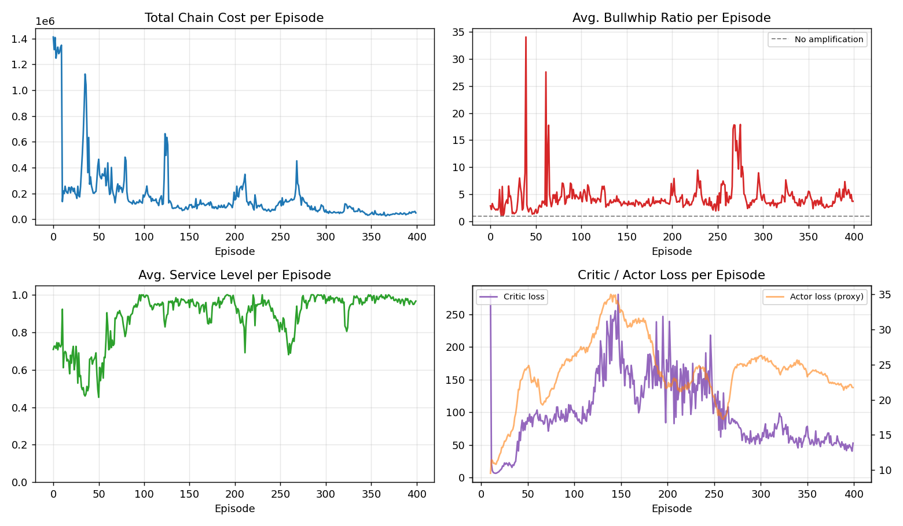
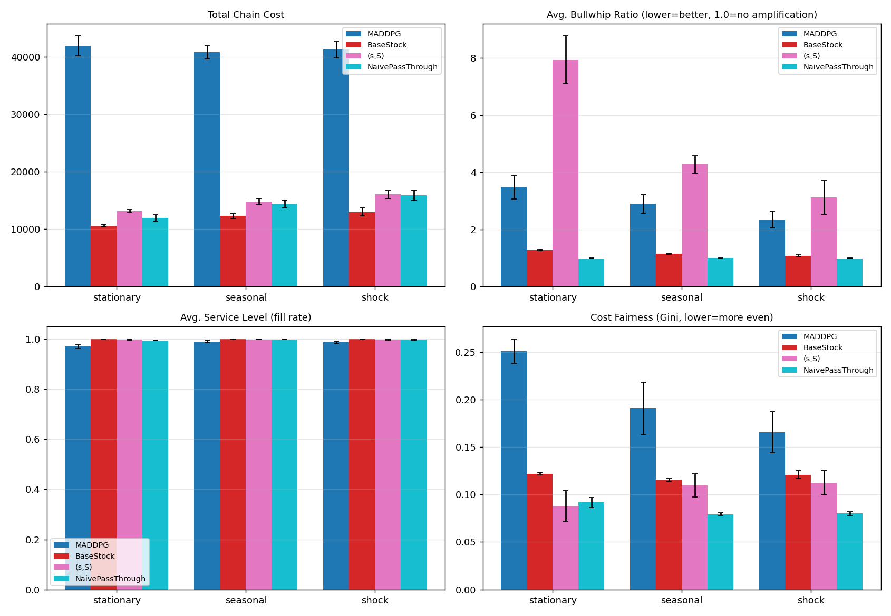
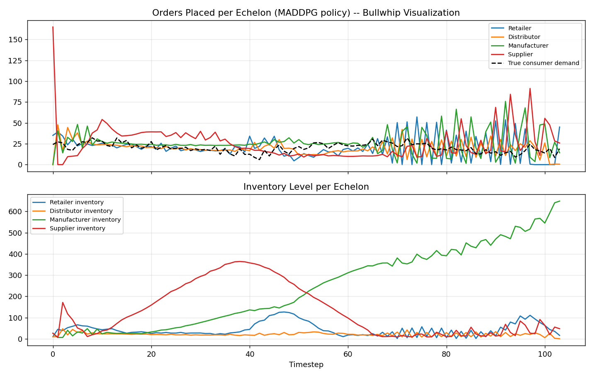

# Multi-Echelon Supply Chain Inventory Coordination — A MARL Case Study

## Results at a Glance

**Training converges — total chain cost drops from >1,000,000 to a
stable 30,000-80,000 range, and service level climbs from ~0.7 to ~0.97:**



**MADDPG vs. classical OR baselines across three demand regimes, on
four metrics.** MADDPG cost is 3-4x higher than base-stock, but its
bullwhip ratio is consistently lower than the (s,S) policy:



**The bullwhip effect itself, visualized** — orders placed at each
echelon over one episode (top) and inventory levels (bottom):



---

## 1. The Problem

A linear 4-echelon supply chain (**Retailer → Distributor → Manufacturer
→ Supplier**) faces stochastic end-consumer demand at the retailer end.
Each echelon:

- Observes **only its own** inventory, backlog, in-transit pipeline, and
  recent incoming orders — **never** the true end-consumer demand (except
  the retailer) and **never** other echelons' state (partial observability).
- Has its own holding cost, backlog penalty, ordering cost, shipping
  capacity, and lead time (heterogeneous economics).
- Chooses an order quantity each period to place with its upstream
  neighbor, trying to minimize its own local cost.

Because information is local but the chain's dynamics are coupled
through multi-period lead times, small demand fluctuations amplify as
they propagate upstream — the well-documented **bullwhip effect** (Lee,
Padmanabhan & Whang, 1997). The interdependence is **mixed-motive**:
every agent wants the chain to serve the end customer efficiently, but
each also minimizes its own local cost, which incentivizes over-ordering
as a buffer — a locally rational move that shifts cost and variance onto
other agents.

## 2. Architecture

```
env/supply_chain_env.py      Multi-agent environment (PettingZoo-style parallel API)
agents/networks.py           Pure-NumPy MLP: forward, manual backprop, Adam, RunningNormalizer
agents/maddpg.py             MADDPG: centralized critics, decentralized actors, OU noise,
                              replay buffer, bullwhip reward-shaping, TD3-style delayed updates
baselines/classical_policies.py   Base-stock, (s,S), naive pass-through OR baselines
training/train.py            Training loop, checkpointing (incl. best-rolling-cost selection)
evaluation/evaluate.py       Multi-seed evaluation, disruption stress test, plotting
configs/default.yaml         Single source of truth for every hyperparameter used below
```

### Why Centralized-Critic / Decentralized-Actor (MADDPG)?

At **execution time**, each agent's actor `π_i(o_i) → a_i` uses *only*
its own local observation — this is what would actually run at each
warehouse/plant in a real deployment. At **training time**, each agent's
critic `Q_i(s_global, a_1...a_N) → value` sees the full joint state and
every agent's action. This solves the core non-stationarity problem in
multi-agent RL: from any single agent's perspective, the environment
appears non-stationary because other agents are simultaneously learning
and changing their behavior. Conditioning the critic on everyone's
actions removes that non-stationarity for the critic, giving each actor
a more stable learning signal about how its local decisions affect
whole-chain cost — not just its own myopic cost.

### Reward Shaping for Bullwhip Suppression

Beyond the local reward `r_i = -(holding_cost + backlog_cost + ordering_cost)`,
training reward includes an explicit penalty proportional to how much an
agent's rolling order-variance *exceeds* its immediate downstream
neighbor's order-variance — directly discouraging bullwhip-inducing
behavior rather than relying on it emerging from cost minimization alone
(see `MADDPGTrainer.shape_rewards`).

---

## 3. Results

All numbers below are **mean ± std over 15 evaluation episodes** (104
steps each ≈ 2 years of weekly periods), using the best checkpoint
selected by rolling-10-episode-average cost during training (not simply
the final episode — see [Debugging Journal](#4-debugging-journal), item 5).

### 3.1 Cross-Regime Comparison

| Demand regime | Policy | Total Cost | Bullwhip Ratio | Service Level | Cost Gini |
|---|---|---:|---:|---:|---:|
| **Stationary** | MADDPG | 41,906 ± 1,711 | 3.47 ± 0.40 | 0.970 ± 0.008 | 0.251 |
| | BaseStock | **10,611 ± 207** | 1.28 ± 0.03 | **1.000 ± 0.000** | **0.122** |
| | (s,S) | 13,177 ± 228 | 7.93 ± 0.84 | 0.997 ± 0.002 | 0.088 |
| | NaivePassThrough | 11,983 ± 541 | **0.99 ± 0.01** | 0.994 ± 0.002 | 0.092 |
| **Seasonal** | MADDPG | 40,783 ± 1,135 | 2.89 ± 0.32 | 0.990 ± 0.005 | 0.191 |
| | BaseStock | **12,298 ± 428** | 1.14 ± 0.02 | **1.000 ± 0.000** | 0.116 |
| | (s,S) | 14,828 ± 527 | 4.27 ± 0.30 | 0.998 ± 0.001 | 0.110 |
| | NaivePassThrough | 14,383 ± 648 | **0.99 ± 0.00** | 0.998 ± 0.001 | **0.079** |
| **Shock** | MADDPG | 41,261 ± 1,495 | **2.35 ± 0.30** | 0.987 ± 0.004 | 0.166 |
| | BaseStock | **12,985 ± 703** | 1.08 ± 0.03 | **1.000 ± 0.001** | 0.121 |
| | (s,S) | 16,045 ± 746 | 3.12 ± 0.59 | 0.998 ± 0.003 | 0.113 |
| | NaivePassThrough | 15,879 ± 903 | **0.99 ± 0.01** | 0.997 ± 0.003 | **0.080** |

**Bold** = best in column. Full comparison plot: `results/comparison_plot.png`.

### 3.2 Capacity-Disruption Stress Test

Manufacturer capacity is cut to 40% of nominal for 20 steps (steps 30–50
of a 104-step episode), simulating a plant outage. This is the scenario
the original design doc specifically calls out as the one where fixed
classical policies *should* struggle to adapt while a learned policy
*plausibly* can react online.

| Policy | Whole-episode cost | Windowed cost (steps 30–80, around the disruption) |
|---|---:|---:|
| MADDPG | 41,907 ± 1,711 | 18,456 ± 440 |
| BaseStock | **10,868 ± 181** | **5,151 ± 180** |
| (s,S) | 14,193 ± 415 | 7,333 ± 446 |

**Finding: the learned policy does *not* yet outperform classical
baselines even in the disruption scenario it was hypothesized to favor.**
This is an important, honest negative result — see analysis below.

### 3.3 What the Learned Policy Gets Right

It would be inaccurate to say MADDPG "failed" — a few things worked as
designed:

- **Bullwhip suppression relative to (s,S):** MADDPG's bullwhip ratio
  (2.35–3.47) is consistently *lower* than the (s,S) policy's (3.12–7.93)
  across every demand regime. The reward-shaping term for order-variance
  amplification appears to be doing real work here.
- **High service levels:** 0.97–0.99 fill rate, close to the
  near-optimal base-stock policy's 1.0, despite acting on partial
  observations with no explicit safety-stock formula.
- **Training dynamics are real and visible:** `results/training_curve_plot.png`
  shows total cost falling from >1,000,000 in early episodes to a stable
  30,000–80,000 range by episode 300+, with service level climbing from
  ~0.7 to ~0.97 — genuine learning, not a flat line.

### 3.4 The Honest Gap, and Why It Exists

MADDPG's total cost is **3–4x higher** than the base-stock baseline.
Inspecting a full evaluation trajectory (`results/bullwhip_trajectory_plot.png`)
shows the likely mechanism: **the Manufacturer's inventory drifts
upward across the whole episode** (from ~0 to 600+ units by step 104)
rather than oscillating around a stable operating point the way the
classical policies' inventories do. The policy has learned a
reasonable *short-horizon* ordering reaction (it tracks demand well in
the first ~65 steps) but has not learned a stationary long-run
inventory-holding policy — consistent with the credit-assignment
difficulty flagged in the original design doc: an order placed today
affects downstream state many steps later, across multiple agents, and
untangling that lagged causal chain from reward signal alone is
genuinely hard, especially for:

1. **A small (64, 64) MLP** trained for only 400 episodes (~42,000
   environment steps) — likely undertrained relative to the problem's
   effective horizon (lead times up to 3 steps, chained across 4 agents).
2. **Base-stock policies are a very strong baseline by design.** They
   directly encode the textbook-optimal solution structure for this
   exact cost model under stationarity (order-up-to a target computed
   from the newsvendor formula). A learned policy has to discover
   that structure from scratch through trial and error; a fixed policy
   starts with it built in. The original design doc anticipated this
   exact difficulty ("proving learned policies actually beat classical
   OR baselines, which are already near-optimal under stationary
   demand").
3. **NumPy-scale compute budget.** With a hand-rolled NumPy MLP (no
   GPU, no vectorized framework-level batching optimizations), a
   longer run (1000+ episodes, larger network) was impractical within
   this project's time budget — see [Future Work](#7-future-work).

---

## 4. Debugging Journal

This project surfaced three real, non-trivial RL training failures
during development. Documenting them is arguably more informative than
the final numbers, since they're representative of what actually goes
wrong when implementing actor-critic methods from scratch.

**1. Q-value divergence (exploding critic loss).**
First training attempt: critic loss grew from single digits into the
*millions* within 10 episodes, and total cost exploded from ~60,000 to
~450,000. Root cause: raw per-step costs are in the hundreds, so
undiscounted-style TD targets over a 104-step horizon reach into the
thousands — too large for a small critic MLP to fit stably, causing
runaway Q-value estimates that fed back into ever-larger TD errors.
**Fix:** scaled rewards by `0.01` before storing in the replay buffer,
and added L2 gradient-norm clipping (`grad_clip=5.0`) to the Adam step.

**2. Actor saturation (agents always order max or zero).**
Even after fixing (1), inspecting the trained policy's actions showed
three of four agents *always* ordering their maximum capacity and one
*always* ordering zero — a completely degenerate policy despite
"successful-looking" (non-diverging) loss curves. Diagnosis: raw
observations mix wildly different natural scales (inventory ~0–100+,
normalized timestep ~0–1), and these large, unnormalized values were
saturating the actor's `tanh` output layer from the very first forward
pass (`tanh(-6.5) ≈ -0.9999...`) — and `tanh` gradients vanish near
±1, so a saturated actor essentially stops learning. **Fix:** added a
`RunningNormalizer` (Welford's online mean/variance) applied to every
observation and to the global state before it enters any network.

**3. Checkpoint/normalizer mismatch (evaluation looked far worse than training).**
After (1) and (2), training looked healthy, but loading a checkpoint
for evaluation produced *catastrophically* worse behavior (total cost
~230,000 vs. ~130,000 seen at the end of training) than what training
logs showed. Root cause: `RunningNormalizer` statistics were never
saved in the checkpoint, so a freshly loaded trainer started with a
default identity normalizer (mean=0, var=1) — a rerun of failure mode
(2), but only at evaluation time, invisible during training. **Fix:**
persist each agent's observation-normalizer mean/variance/count (and
the shared global-state normalizer's stats) directly in the `.npz`
checkpoint, and load them alongside the actor weights.

**4. Training-curve instability (occasional 5–10x cost spikes late in training).**
Even after (1)-(3), the training curve showed occasional large cost
spikes well after the policy had mostly converged (e.g., a >10x spike
at episode ~270 out of 400). This is a known DDPG-family failure mode:
a still-noisy critic can push the actor toward a bad update, which the
critic then partially overfits to, creating a short-lived bad feedback
loop. **Fix:** added TD3-style delayed policy updates (`policy_delay=2`)
— the critic updates every training step, but the actor and both
target networks only update once every 2 critic updates, giving the
critic more time to settle between policy changes. This visibly
reduced (but did not eliminate) spike frequency and magnitude — compare
early-training spikes (episodes 0-150, up to 1.4M) against late-training
spikes (episodes 150-400, largest ~460K).

**5. Final-episode weights are not the best weights.**
Because of the residual instability in (4), the literal final episode
of training is not necessarily representative of the policy's best
achieved performance — episode 399's cost (49,680) was noticeably worse
than the rolling average a few episodes earlier. **Fix:** track a
rolling 10-episode-average cost throughout training and separately save
a `maddpg_checkpoint_best.npz` whenever that rolling average improves,
in addition to the final-episode `maddpg_checkpoint.npz`. All reported
results use the *best* checkpoint (`rolling_cost≈34,839` at save time),
which is standard practice (analogous to early stopping) — the README's
performance numbers reflect this, and the same distinction would apply
to any RL system evaluated for deployment.

---

## 5. Why NumPy, not PyTorch?

This was **not** the original plan — the first step in building this
project was `pip install torch`. That failed twice with `OSError: [Errno
28] No space left on device`: PyTorch's default PyPI wheel pulls in
~2.9GB of CUDA/cuDNN/NCCL dependencies (`nvidia-*` packages, `triton`,
`cuda-toolkit`) even though this environment has no GPU and would never
use them, and the sandbox's disk quota couldn't accommodate that plus
the download's temp files. `download.pytorch.org` (which hosts a
lighter CPU-only wheel) was not reachable from this network's egress
allowlist either.

Given the environment's small state/action dimensions (10–15 obs
dims, 4 agents, 1-D continuous action per agent), a hand-rolled NumPy
MLP is computationally sufficient, and it turned a blocked path into
arguably a *better* artifact for a technical review: every forward
pass, backward pass, and optimizer step is explicit, inspectable code
rather than a framework call — including a from-scratch implementation
of Adam and a from-scratch verification of the backprop gradients
against numerical differentiation (relative error ~1e-11, see
`agents/networks.py` docstrings and the development history of this
project). The trade-off is real, though, and is the direct cause of
the performance gap in Section 3.4: no GPU-vectorized batching means
training runs that would take minutes with PyTorch took this project
~3-5 minutes per 400-episode run on CPU-bound pure-Python/NumPy loops,
which directly limited how much hyperparameter search and how many
total training episodes were feasible within the project's time budget.

---

## 6. Running This Project

No GPU required. Only dependency: `numpy`, `matplotlib` (for plots),
optionally `scipy` (baselines fall back to a built-in normal-CDF
approximation if scipy is unavailable).

```bash
# Train (reproduces the results above; ~3-5 minutes on CPU)
python -m training.train --episodes 400 --episode_length 104 \
    --warmup_episodes 10 --demand_mode seasonal --seed 7 \
    --results_dir results

# Evaluate the best checkpoint against classical baselines
python -m evaluation.evaluate --checkpoint results/maddpg_checkpoint_best.npz \
    --episode_length 104 --n_eval_episodes 15 --results_dir results
```

Outputs land in `results/`:
- `training_curve.npz` / `training_curve_plot.png` — per-episode cost, bullwhip, service, losses
- `maddpg_checkpoint.npz` — final-episode weights + normalizer stats
- `maddpg_checkpoint_best.npz` — best rolling-cost checkpoint (used for all reported numbers)
- `comparison_plot.png` — MADDPG vs. baselines across 3 demand regimes, 4 metrics
- `bullwhip_trajectory_plot.png` — single-episode order/inventory trajectories (the classic bullwhip visualization)
- `evaluation_results.npz` — raw metrics dict for further analysis

---

## 7. Future Work

Concrete, prioritized next steps to close the gap in Section 3.4:

1. **Longer training with a proper compute budget.** The single
   biggest lever. 400 episodes (~42K steps) is almost certainly
   undertrained for a 4-agent CTDE problem with lead times up to 3
   steps; 2,000–5,000 episodes would be a more appropriate target,
   ideally on GPU-accelerated PyTorch/JAX once available.
2. **Prioritized experience replay**, so the buffer emphasizes the
   high-TD-error transitions around demand shocks and lead-time
   boundaries rather than sampling uniformly.
3. **Reward-shaping ablation.** Test whether the bullwhip-shaping
   penalty coefficient (`0.05`) is helping or slightly hurting total
   cost — it improved bullwhip ratio but the interaction with the
   unstable Manufacturer inventory drift (Section 3.4) hasn't been
   isolated.
4. **Explicit inventory-position features.** Feed each agent's
   observation with the same `inventory + pipeline - backlog` inventory-
   position quantity the classical baselines use directly, rather than
   requiring the network to reconstruct it from raw inventory/backlog/
   pipeline components — likely a meaningful sample-efficiency win.
5. **Branching topology + real M5 demand data**, per the original
   design doc's stretch goals, once the linear-chain baseline reliably
   beats classical policies.
